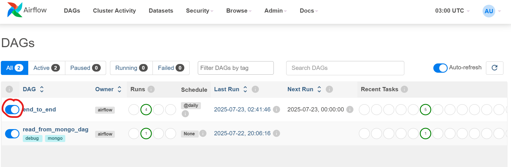
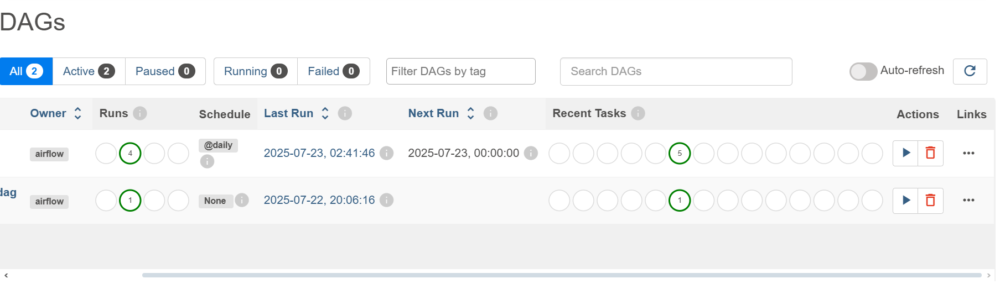
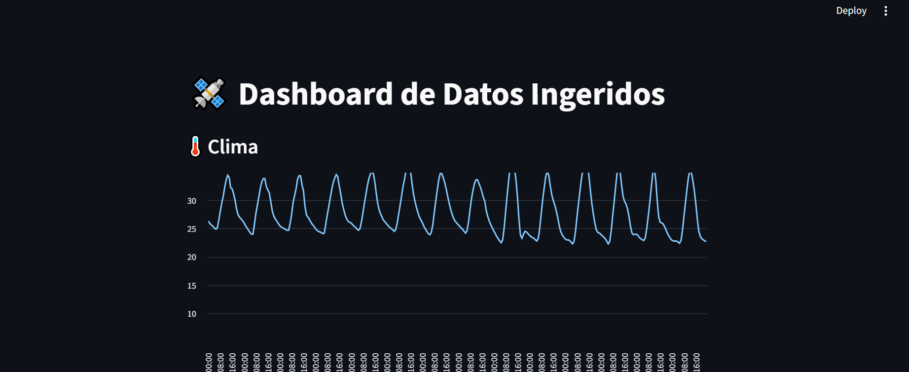
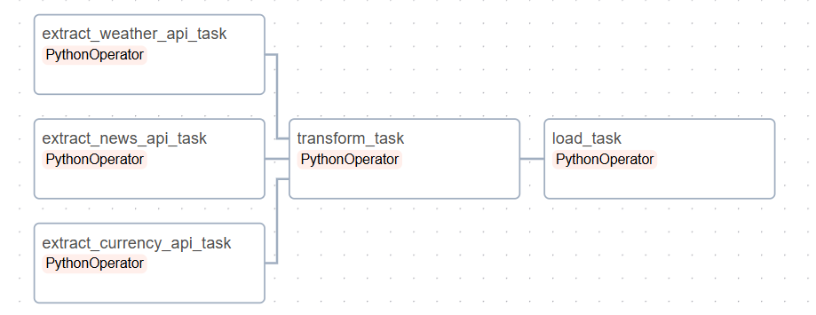

# 📦 Proyecto ETL End-to-End con Airflow, APIs y Visualización en Streamlit

Este proyecto implementa un pipeline de **ETL (Extract, Transform, Load)** de extremo a extremo utilizando **Apache Airflow** para orquestación, **PostgreSQL y MongoDB** para almacenamiento de datos, y **Streamlit** para la visualización interactiva de resultados.

El objetivo es integrar, procesar y visualizar datos desde **tres APIs públicas**:

1. **ExchangeRate API**: obtiene tasas de conversión de divisas (MXN a otras monedas).
2. **Open-Meteo API**: proporciona datos climáticos por hora de los próximos 14 días.
3. **NewsAPI**: extrae los titulares de noticias más relevantes de EE.UU.

Todos los datos son extraídos automáticamente por tareas programadas en Airflow, almacenados en bases de datos relacionales/noSQL, transformados según necesidades analíticas, y finalmente desplegados a través de una interfaz web amigable construida con Streamlit.

## 🚀 ¿Cómo funciona el proyecto?

Este proyecto implementa un pipeline orquestado que sigue el flujo clásico de ETL con **Apache Airflow**:

1. **Extracción (Extract)**  
   Airflow ejecuta tareas programadas que consumen datos de 3 APIs públicas:
   - 📈 **ExchangeRate API**: tasas de cambio actualizadas entre MXN y otras divisas.
   - 🌡️ **Open-Meteo API**: temperaturas horarias de los próximos 14 días en Mérida, Yucatán.
   - 📰 **NewsAPI**: titulares de noticias recientes en Estados Unidos.

2. **Transformación (Transform)**  
   Los datos extraídos son limpiados, estructurados y normalizados:
   - Se convierten formatos.
   - Se filtran los campos relevantes.
   - Se unifican esquemas para integrarse en las bases de datos.

3. **Carga (Load)**  
   Los datos transformados son almacenados en:
   - 🐘 **PostgreSQL**: para datos estructurados (como tipos de cambio y noticias).
   - 🍃 **MongoDB**: para datos semi-estructurados (como series de tiempo climáticas).

4. **Visualización**  
   Se despliega una aplicación interactiva en **Streamlit** para:
   - Visualizar gráficas de temperatura.
   - Ver tendencias en tasas de cambio.
   - Leer titulares de noticias recientes.


## 🛠️ Cómo correr este proyecto por primera vez

### 🔧 Requisitos:
- Docker y Docker Compose instalados.

### 🏁 Pasos:

1. **Clona este repositorio:**
   ```bash
   git clone https://github.com/audileleach/etl-end-to-end.git
   cd etl-end-to-end
2.-Ejecuta todo con un solo comandoen la terminal:

    ```bash
    docker compose up --build

3.-Accede a la interfaz de Airflow y activa el DAG:

Airflow Web UI: http://localhost:8080
Usuario: airflow | Contraseña: airflow



4.-Accede a la interfaz de Airflow y activa el DAG:


3.-Accede al frontend:

Streamlit Frontend: http://localhost:8501


## 🔌 APIs Usadas

### 1. ExchangeRate API
- **URL de ejemplo:** `https://api.exchangerate-api.com/v4/latest/MXN`

#### 📌 Función en el proyecto:
- Permite obtener el valor actualizado de conversión desde MXN a otras divisas.
- Se almacena en MongoDB o PostgreSQL para su posterior visualización.

### 2. Open-Meteo API
URL de ejemplo: https://api.open-meteo.com/v1/forecast?latitude=20.9754&longitude=-89.617&hourly=temperature_2m&timezone=auto&forecast_days=14

#### 📌 Función en el proyecto:
Extrae temperaturas horarias para Mérida, Yucatán, para los próximos 14 días.

Se utiliza para agregar una dimensión climática al análisis de datos ETL.

Los datos se almacenan y pueden visualizarse en los dashboards.

### 3. NewsAPI
URL de ejemplo: https://newsapi.org/v2/top-headlines?country=us&apiKey=YOUR_API_KEY&pageSize=5

#### 📌 Función en el proyecto:
Extrae los 5 titulares más recientes de Estados Unidos.


## ⛓️ Orchestration Pipeline




Extract Tasks: Llama a cada API.

Transform Task: Procesa y limpia la respuesta.

Load Task: Inserta los datos en PostgreSQL y MongoDB.

## 🧑‍💻 Autores
Gustavo Fuentes Marín

Materia: Massive Data Management - 5A

UPY - 2025